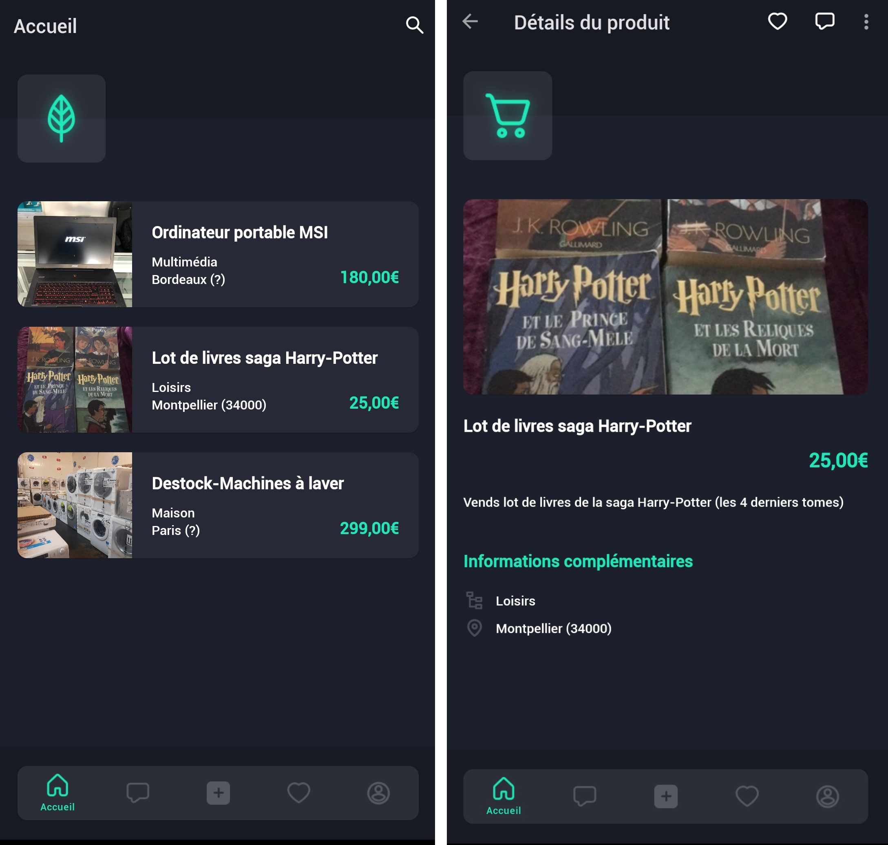

<br />
<p align="center">
  <a href="https://github.com/1visible/Vitreen">
  </img>
  </a>

  <p align="center">
    A University classified ads project for Android !
    <br />
  <a href="https://github.com/1visible/Vitreen#usage"><strong>View Demo</strong></a>
    •
    <a href="https://github.com/1visible/Vitreen/issues"><strong>Report Bug</strong></a>
    •
    <a href="https://github.com/1visible/Vitreen/issues"><strong>Request Feature</strong></a>
  </p>
</p>


<!-- TABLE OF CONTENTS -->
## Table of Contents

* [About the Project](#about-the-project)
  * [Tools used](#tools-used)
* [Installation](#installation)
* [Usage](#usage)
* [Roadmap](#roadmap)
* [Contact](#contact)


<!-- ABOUT THE PROJECT -->
## About The Project

Vitreen is an online classified ads mobile application project for individuals or professionals. Its goal is to allow users to put back in the showcase the objects they want to get rid of in order to give them a second life.
Vitreen differs from other applications by its ability to accommodate inventory in a warehouse, avoiding waste, particularly due to the inability of companies to carry out their destocking.
This project was carried out as a team during our training in M1 Computer Science at the University of Montpellier.

### Tools used
🔨 We used various tools to carry out our project, from communication to design to programming. Below is the list of the main tools that have served us:
* [Android Studio](https://developer.android.com/studio) (for programming)
* [Github](https://github.com) (for version control and source code management)
* [Figma](https://www.figma.com) (for prototyping/design)
* [Trello](https://trello.com) (for organization and time management)
* [Discord](https://discordapp.com) (for communication)


<!-- INSTALLATION -->
## Installation

💻 If you want a local copy of the project, just clone the repo and open the project in Android Studio.
```sh
git clone https://github.com/1visible/Vitreen.git
```


<!-- USAGE EXAMPLES -->
## Usage

📱 Just download and install our app on your smartphone or tablet by clicking [here](https://www.dropbox.com/s/wg0xozpsuu6nz1i/Vitreen.apk?dl=1)

<p align="center">
  
</p>

<!-- ROADMAP -->
## Roadmap

🔧 See the [open issues](https://github.com/1visible/Vitreen/issues) for a list of proposed features (and known issues).


<!-- CONTACT -->
## Contact

✉ Benjamin ADOLPHE - benjaminadolphe4@gmail.com

✉ Nicolas LAURET - redx.6345@gmail.com

🔗 Project Link: [https://github.com/1visible/Vitreen](https://github.com/1visible/Vitreen)
